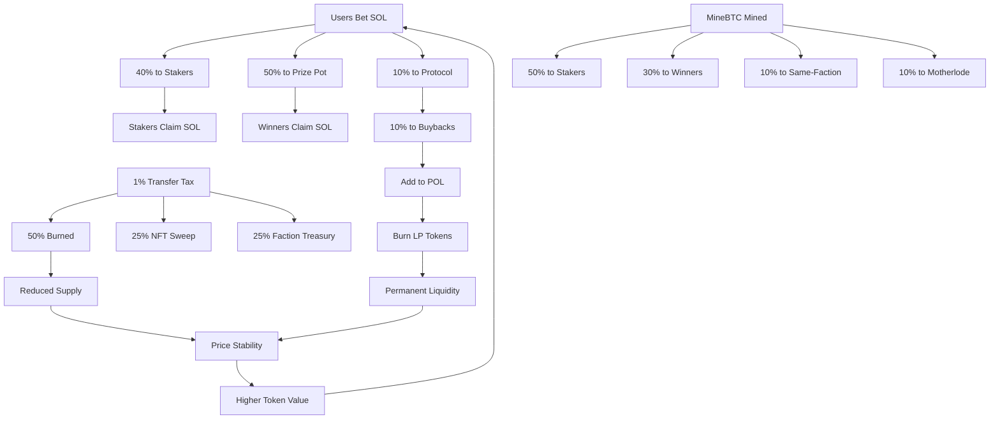

# � MineBTC: Faction Surge - Complete Game Guide

**The Next-Generation Blockchain Gaming Economy on Solana**

solana-test-validator --reset \
 --limit-ledger-size 100000000 \
 --bpf-program CoREENxT6tW1HoK8ypY1SxRMZTcVPm7R94rH4PZNhX7d core.so \
 --clone CoREENxT6tW1HoK8ypY1SxRMZTcVPm7R94rH4PZNhX7d \
--url https://api.mainnet-beta.solana.com

solana-keygen new -o target/deploy/minebtc-keypair.json --force --no-bip39-passphrase

solana-test-validator --reset \
 --limit-ledger-size 100000000 \
 --bpf-program CoREENxT6tW1HoK8ypY1SxRMZTcVPm7R94rH4PZNhX7d core.so \
 --clone CoREENxT6tW1HoK8ypY1SxRMZTcVPm7R94rH4PZNhX7d \
 --url https://api.mainnet-beta.solana.com

anchor build -p minebtc

solana program deploy target/deploy/minebtc.so \
 --program-id target/deploy/minebtc-keypair.json \
 --keypair wallet-keypair.json \
 --url http://127.0.0.1:8899

solana program deploy target/deploy/minebtc.so \
 --program-id target/deploy/minebtc-keypair.json \
 --keypair wallet-keypair.json \
 --url https://api.devnet.solana.com

---

## 🌟 Overview

MineBTC is a revolutionary faction-based betting and mining game that combines strategic gameplay, DeFi mechanics, and NFT utility to create a sustainable, deflationary economy. Built on Solana's high-performance blockchain, MineBTC offers:

- **Provably Fair Randomness**: Commit-reveal scheme ensures transparency and prevents manipulation
- **Multi-Layered Rewards**: Earn through betting, staking, referrals, and faction performance
- **Deflationary Tokenomics**: 1% transfer tax with burns and buybacks
- **NFT Power System**: Eggs provide persistent hashpower multipliers
- **Dynamic Emission**: Mining rate adjusts based on market prices to maintain sustainability

---

## 🎯 Core Game Mechanics

### Faction Surge: The Betting Game

#### How It Works

1. **12 Factions, 24 Blocks**: Each faction is randomly assigned 2 blocks per round
2. **Place Your Bets**: Bet SOL on specific blocks (1-24) or use faction strategies (highest/lowest)
3. **Provably Fair Selection**: Cranker bots use commit-reveal randomness to select the winning block
4. **Multi-Tier Rewards**:
   - **Winners**: Share the prize pot (SOL) + MineBTC rewards
   - **Same-Faction Losers**: Earn consolation MineBTC rewards
   - **Stakers**: Earn from staker fees (40% of all bets)
   - **Motherlode**: 1/625 chance to win the accumulated jackpot

#### Bet Types

```typescript
// Direct block betting
BetType::Block(block_number)  // Bet on blocks 1-24

// Faction strategy betting
BetType::FactionHighest(faction_id)  // Bet on the highest block assigned to a faction
BetType::FactionLowest(faction_id)   // Bet on the lowest block assigned to a faction
```

#### Fee Structure

Every bet is split as follows:

- **10%**: Protocol fee (treasury for development & operations)
- **40%**: Stakers rewards (distributed to MineBTC and LP stakers)
- **50%**: Prize pot (distributed to winners)

---

## 💎 Staking System

### MineBTC Staking

Stake your MineBTC tokens to earn **dual rewards**:

1. **SOL Rewards**: From 40% of all betting fees
2. **MineBTC Rewards**: From mining emissions (50% of total supply)

**Hashpower Formula**: Your reward share depends on your hashpower

```
Hashpower = Amount × Lockup Multiplier × Doge Multiplier
```

**Lockup Periods**:

- 30 days: 1.0x multiplier
- 90 days: 2.5x multiplier
- 180 days: 5.0x multiplier
- 1 year: 9.0x multiplier
- 3 years: 15.0x multiplier

### LP Token Staking

Stake Raydium LP tokens (MineBTC-SOL) to earn the same dual rewards with higher APRs.

### Refining Fee

When claiming MineBTC rewards, a 5% refining fee is charged and **redistributed to all other stakers**, creating a compounding reward loop for long-term holders.

---

## 🐉 Doge NFT System

### Bonding Curve Pricing

Eggs use a bonding curve pricing model:

```
Price = Base_Price + (Current_Supply² / Curve_A)
```

Each subsequent egg costs more, creating natural scarcity.

### Doge Tiers & Free Tickets

When minting eggs, choose a ticket tier:

- **Bronze**: 0.01 SOL × 1000 tickets
- **Silver**: 0.05 SOL × 200 tickets
- **Gold**: 0.1 SOL × 100 tickets

Free tickets can be used for betting instead of SOL.

### Hashpower Multipliers

Stake up to **5 Eggs** to boost your mining hashpower:

```
1 Egg:  1.3x multiplier
2 Eggs: 1.6x multiplier
3 Eggs: 2.0x multiplier
4 Eggs: 2.5x multiplier
5 Eggs: 3.0x multiplier
```

**Max Multiplier**: 6.9x (with 5 eggs + max lockup)

### Power System

Eggs accumulate "power" over time:

- Power is earned when claiming MineBTC rewards
- Power is distributed proportionally to all staked eggs
- Higher power = rarer/more valuable NFTs

---

## 🔥 Deflationary Tax System

### 1% Transfer Tax (Token-2022)

All MineBTC transfers are taxed 1%, distributed as:

- **~50%**: Burned (permanently removed from supply)
- **~25%**: NFT Floor Sweep vault (buy NFTs, support floor price)
- **~25%**: Faction Treasury (distributed to top-performing factions)

### 7-Day Distribution Rounds

Every week, factions compete in a hashpower tournament:

1. **Ranking Phase**: All 12 factions are ranked by total hashpower
2. **Reward Calculation**: Top factions receive larger shares
   - Rank 1: 15% of faction treasury
   - Rank 2: 13%
   - Rank 3: 11%
   - ... decreasing to bottom ranks
3. **Distribution**: Rewards are distributed to each faction's stakers (50% MineBTC stakers, 50% LP stakers)

This creates **faction tribalism** and incentivizes players to stake within their faction.

---

## 📈 Dynamic Emission & Protocol-Owned Liquidity

### Price Oracle System

Every 30 minutes, the protocol:

1. Takes a price snapshot via a small SOL → MineBTC swap on Raydium
2. Records price history (8 snapshots over 4 hours)
3. Calculates a 4-hour moving average

### Adaptive Mining Rate

If price drops >3% over 4 hours:

- **Reduce emission** by 10% (reduce sell pressure)
- **Earmark SOL** for Protocol-Owned Liquidity (POL)

If price rises >3%:

- **Increase emission** by 10% (increase rewards)

### POL Addition

After 8 snapshots (4 hours), the protocol:

1. Uses earmarked SOL and MineBTC from buybacks
2. Adds liquidity to Raydium pool
3. **Burns the LP tokens** (permanent liquidity)

This creates a **self-sustaining liquidity flywheel**.

---

## 🎁 Referral & Autominer Systems

### Referral System

Earn **10% of your referrals' staking rewards** (both SOL and MineBTC) forever:

- Share your wallet address as a referral code
- Referrals register with your code when initializing
- You earn passively as they claim rewards

### Autominer Vaults

Set up automated betting strategies:

```typescript
// Example: Bet 0.1 SOL per round on Faction 0's highest block, for 100 rounds
init_autominer({
  factions_config: { faction_id: 0, strategy: Highest },
  sol_per_round: 100_000_000, // 0.1 SOL
  num_rounds: 100,
});
```

Deposit SOL into your autominer vault, and a keeper bot will execute bets for you each round.

---

## 🛠️ Technical Architecture

### Solana Programs

- **Token-2022**: MineBTC uses transfer fees for deflationary mechanics
- **Metaplex Core**: Doge NFTs with royalties and on-chain metadata
- **Raydium CLMM**: Liquidity pool for MineBTC-SOL trading

### Security Features

- **Commit-Reveal Randomness**: Prevents front-running and manipulation
- **PDA-Based Vaults**: All funds secured by program-derived addresses
- **Faction Isolation**: Each faction has isolated reward pools and indexes
- **Emergency Withdrawals**: 15% penalty for early unstaking

### Account Structure

```
GlobalConfig → FactionState (×12) → PlayerData (per user)
              → GameSession (per round)
              → MineBtcMining
              → TaxConfig
              → EggConfig
```

---

## 📊 Tokenomics Summary

### Supply Distribution

- **50%**: Staking rewards (distributed over time)
- **30%**: Prize pot rewards (distributed to game winners)
- **10%**: Same-faction rewards (distributed to losing bettors)
- **10%**: Motherlode pot (jackpot accumulation)

### Deflationary Mechanisms

1. **1% Transfer Tax** → 50% burned
2. **5% Refining Fee** → Redistributed to stakers
3. **LP Token Burns** → Permanent liquidity lock

### Revenue Streams (for players)

1. **Betting Wins**: SOL + MineBTC
2. **Staking Rewards**: SOL + MineBTC
3. **Faction Performance**: MineBTC (weekly distributions)
4. **Referrals**: 10% of referrals' rewards
5. **Motherlode Jackpot**: 1/625 chance per bet

---

## 🚀 Getting Started

### 1. Initialize Your Account

```bash
# Create a player account and join a faction
initialize_player --faction-id 0 --referral-code <optional>
```

### 2. Mint Eggs (Optional)

```bash
# Mint 3 eggs for your faction with Silver tier tickets
batch_mint_eggs --faction-id 0 --count 3 --tier 1
```

### 3. Stake Your Eggs

```bash
# Stake an egg to boost hashpower
stake_egg --egg-mint <egg_pubkey>
```

### 4. Stake MineBTC

```bash
# Stake 1000 MineBTC with 90-day lockup (2.5x multiplier)
stake_minebtc --amount 1000000000 --lockup-days 90 --position 0
```

### 5. Place Bets

```bash
# Bet 0.5 SOL on block 12
join_round --amount 500000000 --bet-type Block(12)

# Or use a faction strategy
join_round --amount 500000000 --bet-type FactionHighest(0)
```

### 6. Claim Rewards

```bash
# Claim betting winnings from round 42
claim_round_rewards --round-id 42

# Claim staking rewards
claim_sol_rewards
claim_minebtc_rewards
```

---

## 🏆 Pro Strategies

### Maximize Hashpower

1. **Max Lockup**: 3-year lockup = 15x multiplier
2. **5 Eggs Staked**: + 3x multiplier = **45x total hashpower**
3. **Compound Rewards**: Restake claimed MineBTC to grow your position

### Faction Warfare

- Join high-performing factions for weekly treasury rewards
- Coordinate with faction members to dominate hashpower rankings
- Strategic betting: use faction strategies ( Highest/Lowest) to maximize win probability

### Referral Empire

- Build a referral network to earn 10% of all their staking rewards
- Share on social media, Discord, and forums
- Passive income scales with your referrals' success

---

## 🔗 Developer Resources

### Deployment Commands

```bash
# Build the program
anchor build -p minebtc

# Deploy to devnet
solana program deploy target/deploy/minebtc.so \
  --program-id target/deploy/minebtc-keypair.json \
  --keypair wallet-keypair.json \
  --url https://api.devnet.solana.com

# Generate IDL
anchor idl build -p minebtc
```

### Local Testing

```bash
# Start local validator with Metaplex Core
solana-test-validator --reset \
  --limit-ledger-size 100000000 \
  --bpf-program CoREENxT6tW1HoK8ypY1SxRMZTcVPm7R94rH4PZNhX7d core.so \
  --clone CoREENxT6tW1HoK8ypY1SxRMZTcVPm7R94rH4PZNhX7d \
  --url https://api.mainnet-beta.solana.com
```

### Key Program IDs

- **MineBTC Program**: `9L7Gc16Wi5CcBw8rDmXFWThdBkTDBpvLaDXdbFKQK95A`
- **Metaplex Core**: `CoREENxT6tW1HoK8ypY1SxRMZTcVPm7R94rH4PZNhX7d`

---

## 💰 Economic Flywheel



---

## 🎬 Conclusion

MineBTC represents the convergence of **GameFi**, **DeFi**, and **NFTfi** into a cohesive, sustainable ecosystem. With provably fair mechanics, deflationary tokenomics, and multiple earning strategies, it creates a **multi-billion dollar gaming economy** where players, stakers, and factions compete for dominance.

**Join your faction. Stake your claim. Win the surge.**

---

**📱 Community Links**  
Discord | Twitter | Website | Documentation

**⚠️ Disclaimer**: This is a high-risk, high-reward game. Never invest more than you can afford to lose. Always DYOR.
