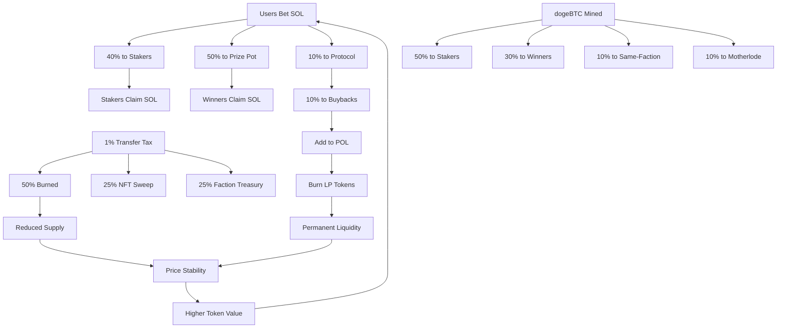

# MineBTC

[](https://github.com/LifeOrDream/MineBtc-fi/actions/workflows/ci.yml)
[](LICENSE)

Faction warfare game on Solana. Bet SOL on 24 blocks, earn rewards, mine dogeBTC tokens, stake NFTs for hashpower multipliers, and compete in weekly faction tournaments.

**Website:** [minebtc.fun](https://minebtc.fun) | **Twitter:** [@minebtcdotfun](https://x.com/minebtcdotfun)

---

## Program Addresses

| Network | Program ID |
|---------|-----------|
| **Mainnet** | `Hw9uxvtmQdS57N6aNwJA5iqjSqzhRDdopCHgm8EPwkqx` |
| Devnet | `E4Bqhmc5vwfHuraMmiv2zuj28oDy9Mcp1DprazPLwXuL` |

| Account | Address |
|---------|---------|
| DogeBTC Mint (Token-2022) | `BwMCF5LSHPvrR8pLVvcsa4k1AMg4VWVnMWUiNEXMtLkE` |
| Doge NFT Collection | `6S85vw5zZJHC3KvmVfGmfWMpTY1aSbUCcU6xdz5bhmo5` |
| Raydium Pool | `HmPwHy2z9aQa2Ce2kMhwvjaiqCBiE7kdHppkUP6jZ7nf` |
| Upgrade Authority (Multisig) | `2Xze8BhdWV3GoJUyzpQPF7d1N2KUCS1TCkdVECfkDTcd` |

---

## Architecture

```
programs/
└── mineBTC/
    └── src/
        ├── lib.rs              # Entry point — 71 instructions
        ├── state.rs            # Account definitions
        ├── errors.rs           # Error types
        ├── events.rs           # Event definitions
        ├── genescience.rs      # Doge DNA & mutation system
        ├── mpl_core_helpers.rs # Metaplex Core integration
        └── instructions/
            ├── admin.rs        # Admin & config management
            ├── user.rs         # Player, betting, autominer
            ├── game.rs         # Round lifecycle
            ├── stake.rs        # MineBTC/LP/Doge staking
            ├── doges.rs        # NFT minting, breeding
            ├── economy.rs      # Price oracle, POL, buybacks
            ├── tax.rs          # Transfer tax distribution
            └── helper.rs       # Shared utilities
```

**Account Structure:**
```
GlobalConfig → FactionState (x12) → PlayerData (per user)
             → GameSession (per round)
             → MineBtcMining
             → TaxConfig
             → DogeConfig
```

---

## Building from Source

```bash
# Prerequisites: Rust 1.90.0+, Anchor 0.31.1, Solana CLI 2.2.12+

# Build
anchor build -p minebtc

# Lint
cargo fmt --all -- --check
cargo clippy --all-targets -- -D warnings

# Generate IDL
anchor idl build -p minebtc
```

---

## Game Mechanics

### Faction Surge: The Betting Game

- **12 factions, 24 blocks** — each faction is randomly assigned 2 blocks per round
- **60-second rounds** — bet SOL on blocks or faction strategies
- **Provably fair** — commit-reveal randomness prevents manipulation
- **Multi-tier rewards:**
  - Winners: SOL prize pot + dogeBTC mining rewards
  - Same-faction: Consolation dogeBTC rewards
  - Stakers: 40% of all betting fees
  - Motherlode: 1/625 jackpot chance per bet

### Staking System

Stake dogeBTC, LP tokens, or Doge NFTs for dual SOL + dogeBTC rewards.

**Hashpower = Amount x Lockup Multiplier x Doge Multiplier**

| Lockup | Multiplier |
|--------|-----------|
| 30 days | 1.0x |
| 90 days | 2.5x |
| 180 days | 5.0x |
| 1 year | 9.0x |
| 3 years | 15.0x |

Stake up to 5 Doge NFTs for up to 3.0x additional multiplier (max 45x total hashpower).

### Doge NFTs

- **Bonding curve pricing:** `price = base_price + curve_a * cbrt(minted^2)`
- **24,690 max supply**
- **On-chain DNA** — deterministic trait generation via genescience algorithm
- **Breeding** — combine two Doges to produce offspring with mixed traits
- **Power system** — Doges accumulate power over time from staking rewards

### Deflationary Tokenomics

dogeBTC uses Token-2022 with a **1% transfer tax**, distributed:
- ~50% burned (permanently removed)
- ~25% NFT floor sweep vault
- ~25% faction treasury (weekly tournament rewards)

**Additional deflationary mechanics:**
- 10% refining fee on dogeBTC withdrawals (redistributed to stakers)
- Protocol-owned liquidity additions with LP token burns
- Dynamic emission adjustments based on 4-hour price oracle

---

## Economic Flywheel



---

## Security

Found a vulnerability? See [SECURITY.md](SECURITY.md) for responsible disclosure guidelines.

**Program security features:**
- Commit-reveal randomness (prevents front-running)
- PDA-based vaults (all funds secured by program-derived addresses)
- Faction isolation (isolated reward pools and indexes)
- Multisig upgrade authority via [Squads](https://squads.so)

---

## Contributing

See [CONTRIBUTING.md](CONTRIBUTING.md) for development setup and guidelines.

## License

Apache License 2.0 — see [LICENSE](LICENSE).

---

**Disclaimer:** This is a high-risk, high-reward game. Never invest more than you can afford to lose. Always do your own research.
