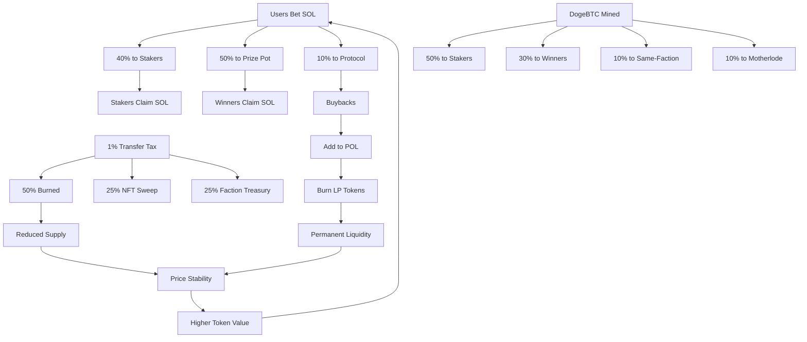

<p align="center">
  <a href="https://minebtc.fun">
    
  </a>
</p>

<h1 align="center">MineBTC</h1>

<p align="center">
  <strong>Faction Warfare meets DeFi on Solana</strong>
</p>

<p align="center">
  <a href="https://minebtc.fun"></a>
  <a href="https://docs.minebtc.fun"></a>
  <a href="https://github.com/LifeOrDream/MineBtc-fi/actions/workflows/ci.yml"></a>
</p>

<p align="center">
  <a href="https://x.com/minebtcdotfun"></a>
  <a href="https://minebtc.fun"></a>
  <a href="https://solana.com"></a>
  <a href="./LICENSE"></a>
</p>

---

Bet SOL on 24 blocks across 12 factions. Win the prize pot. Mine dogeBTC. Stake NFTs for hashpower multipliers. Compete in weekly faction tournaments. All on [Solana](https://solana.com).

> **Mainnet Live** — Program deployed and verified on Solana Mainnet. Upgrade authority secured via [Squads](https://squads.so) multisig.

---

## Program Addresses

| | Address |
|---|---------|
| **MineBTC Program** | [`Hw9uxvtmQdS57N6aNwJA5iqjSqzhRDdopCHgm8EPwkqx`](https://solscan.io/account/Hw9uxvtmQdS57N6aNwJA5iqjSqzhRDdopCHgm8EPwkqx) |
| **DogeBTC Token** (Token-2022) | [`BwMCF5LSHPvrR8pLVvcsa4k1AMg4VWVnMWUiNEXMtLkE`](https://solscan.io/token/BwMCF5LSHPvrR8pLVvcsa4k1AMg4VWVnMWUiNEXMtLkE) |
| **Token Vault** (~2.1B DogeBTC) | [`6Cc43qKbxHqtSDZJQMfbQ8BkKpYECEmHwxL4ZoQUbinZ`](https://solscan.io/account/6Cc43qKbxHqtSDZJQMfbQ8BkKpYECEmHwxL4ZoQUbinZ) |
| **Doge NFT Collection** | [`6S85vw5zZJHC3KvmVfGmfWMpTY1aSbUCcU6xdz5bhmo5`](https://solscan.io/account/6S85vw5zZJHC3KvmVfGmfWMpTY1aSbUCcU6xdz5bhmo5) |
| **Raydium Pool** (DogeBTC/SOL) | [`HmPwHy2z9aQa2Ce2kMhwvjaiqCBiE7kdHppkUP6jZ7nf`](https://solscan.io/account/HmPwHy2z9aQa2Ce2kMhwvjaiqCBiE7kdHppkUP6jZ7nf) |
| **Fee Recipient** (2-of-3 Multisig) | [`4XbSNcy77rEyx4VT48w46UXCYFrAz3HR98w9Zp53nm5f`](https://solscan.io/account/4XbSNcy77rEyx4VT48w46UXCYFrAz3HR98w9Zp53nm5f) |
| **Upgrade Authority** | [`2Xze8BhdWV3GoJUyzpQPF7d1N2KUCS1TCkdVECfkDTcd`](https://solscan.io/account/2Xze8BhdWV3GoJUyzpQPF7d1N2KUCS1TCkdVECfkDTcd) |

---

## What is MineBTC?

MineBTC is a **faction warfare game** where every round creates winners, losers, and an economy that feeds itself.

**12 factions. 24 blocks. 60-second rounds.** Each round, factions are randomly assigned 2 blocks. Players bet SOL on blocks. A provably fair commit-reveal mechanism selects the winner. Rewards cascade through the system:

- **Winners** split the SOL prize pot + mine dogeBTC tokens
- **Same-faction losers** earn consolation dogeBTC rewards
- **Stakers** earn 40% of all betting fees (SOL + dogeBTC)
- **Motherlode jackpot** — 1/625 chance per bet for the accumulated pot

The result: a self-sustaining game economy where betting fees fund staker rewards, transfer taxes burn supply, and protocol-owned liquidity grows permanently.

---

## Protocol Architecture

```
┌────────────────────────────────────────────────────────────────┐
│                      MineBTC Protocol                          │
│                                                                │
│  ┌──────────────┐  ┌──────────────┐  ┌──────────────────────┐ │
│  │ Faction Surge │  │   Staking    │  │    Doge NFTs         │ │
│  │ 24-block game │  │ DogeBTC, LP, │  │ 24,690 supply,       │ │
│  │ betting with  │  │ Doge NFT     │  │ 256-bit DNA,         │ │
│  │ commit-reveal │  │ staking      │  │ bonding curve mint   │ │
│  └──────┬───────┘  └──────┬───────┘  └──────────────────────┘ │
│         │                 │                                    │
│  ┌──────┴─────────────────┴───────┐                           │
│  │         Core Economy           │  ┌──────────────────────┐ │
│  │  GlobalConfig, FactionState,   │  │   Price Oracle       │ │
│  │  mining emissions, fee splits, │──│  4-hour TWAP,        │ │
│  │  autominer vaults, referrals   │  │  dynamic emission    │ │
│  └────────────────┬───────────────┘  └──────────────────────┘ │
│                   │                                            │
│  ┌────────────────┴───────┐  ┌───────────────────────────────┐│
│  │    Tax System          │  │   Protocol-Owned Liquidity    ││
│  │ 1% transfer tax:       │  │  Raydium pool integration,   ││
│  │ burn + NFT sweep +     │  │  LP token burns,             ││
│  │ faction treasury       │  │  permanent liquidity growth   ││
│  └────────────────────────┘  └───────────────────────────────┘│
└────────────────────────────────────────────────────────────────┘
```

### Source Structure

```
programs/mineBTC/src/
├── lib.rs              # 71 instructions
├── state.rs            # Account definitions
├── errors.rs           # Error types
├── events.rs           # Event definitions
├── genescience.rs      # Doge DNA & mutation system
├── mpl_core_helpers.rs # Metaplex Core integration
└── instructions/
    ├── admin.rs        # Admin & config management
    ├── user.rs         # Player, betting, autominer
    ├── game.rs         # Round lifecycle
    ├── stake.rs        # DogeBTC / LP / Doge staking
    ├── doges.rs        # NFT minting, breeding
    ├── economy.rs      # Price oracle, POL, buybacks
    ├── tax.rs          # Transfer tax distribution
    └── helper.rs       # Shared utilities
```

---

## DogeBTC Token

**DogeBTC** is a Token-2022 token with a **1% transfer tax** baked into every transaction. Tax revenue is distributed automatically:

| Split | Purpose |
|-------|---------|
| **~50% Burn** | Permanently removed from supply — deflationary by design |
| **~25% NFT Floor Sweep** | Treasury buys Doge NFTs to support floor price |
| **~25% Faction Treasury** | Distributed weekly to top-performing factions |

### Dynamic Emission

Every 30 minutes, the protocol takes a price snapshot via Raydium swap. An 8-point moving average over 4 hours controls emission:

- **Price drops >3%** — emission reduced 10% (reduce sell pressure)
- **Price rises >3%** — emission increased 10% (increase rewards)
- **SOL earmarked during drops** — used for Protocol-Owned Liquidity additions with **LP tokens burned permanently**

---

## Staking System

Stake DogeBTC, LP tokens, or Doge NFTs to earn **dual rewards** (SOL + DogeBTC) from 40% of all betting fees plus mining emissions.

**Hashpower = Amount x Lockup Multiplier x Doge Multiplier**

| Lockup | Multiplier | | Staked Doges | Multiplier |
|--------|-----------|---|-------------|-----------|
| 30 days | 1.0x | | 1 Doge | 1.3x |
| 90 days | 2.5x | | 2 Doges | 1.6x |
| 180 days | 5.0x | | 3 Doges | 2.0x |
| 1 year | 9.0x | | 4 Doges | 2.5x |
| 3 years | 15.0x | | 5 Doges | 3.0x |

**Max hashpower: 45x** (3-year lockup + 5 staked Doges)

A **10% refining fee** on DogeBTC withdrawals is redistributed to all other stakers, creating a compounding reward loop for long-term holders.

---

## Doge NFTs

**24,690 unique Doge NFTs** — each with deterministic on-chain DNA generated by the genescience algorithm.

- **Bonding curve pricing:** `price = base_price + curve_a * cbrt(minted^2)`
- **Base price:** 0.69 SOL, scaling to ~4.8 SOL at full mint
- **Hashpower multipliers** — stake up to 5 Doges to boost staking rewards up to 3x
- **Power system** — Doges accumulate power over time from staking activity
- **Breeding** — combine two Doges to produce offspring with mixed DNA traits
- **Built on Metaplex Core** with enforced royalties

---

## Faction Warfare

**12 factions** compete weekly in hashpower tournaments for faction treasury rewards:

1. Factions are ranked by total hashpower of their stakers
2. Top factions receive larger shares of the faction treasury
3. Rewards flow to each faction's stakers (50% DogeBTC stakers, 50% LP stakers)

This creates **faction tribalism** — players coordinate to dominate hashpower rankings.

---

## Economic Flywheel



---

## Building from Source

```bash
# Prerequisites: Rust 1.90.0+, Anchor 0.31.1, Solana CLI 2.2.12+

# Build
anchor build -p minebtc

# Lint
cargo fmt --all -- --check
cargo clippy --all-targets -- -D warnings

# Generate IDL
anchor idl build -p minebtc
```

---

## Security

Program security features:
- **Commit-reveal randomness** — prevents front-running and manipulation
- **PDA-based vaults** — all funds secured by program-derived addresses
- **Faction isolation** — isolated reward pools prevent cross-contamination
- **Multisig upgrade authority** — program upgrades require [Squads](https://squads.so) approval

Found a vulnerability? See **[SECURITY.md](./SECURITY.md)** for responsible disclosure guidelines.

---

## Contributing

See **[CONTRIBUTING.md](./CONTRIBUTING.md)** for development setup and guidelines.

---

## Community

<p align="center">
  <a href="https://x.com/minebtcdotfun"></a>
  <a href="https://minebtc.fun"></a>
</p>

---

## License

This project is licensed under the **Business Source License 1.1** — see [LICENSE](./LICENSE) for details.

Production use requires a commercial license from LifeOrDream Labs. On **February 16, 2028**, the code transitions to Apache License 2.0.

---

<p align="center">
  <sub>Faction warfare meets DeFi. Bet, stake, mine, compete. Built on <a href="https://solana.com">Solana</a>.</sub>
</p>
